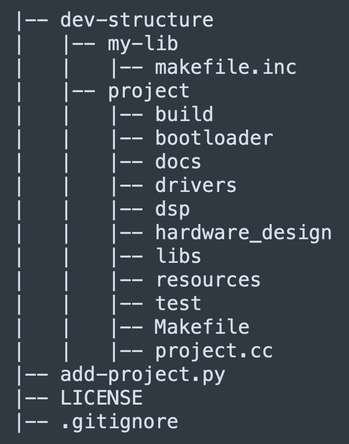

# dev-env

dev-env is used to test folder strutures, etc.

## Directory Structure



## Language Servers for Sublime Text

__LSP-clangd__ for C/C++ and __LSP-pyright__ for Python.

## RTFM

[the manual](https://www.gnu.org/software/make/manual/)

## TODO

- Figure makefile for the project
- get testing working with criterion
- how to list source files through the dir - foreach example not working
- look into built-in variables
- why doesn't ```$(notdir $(wildcard $(patsubst %,%/*.cc,$(PACKAGES))))``` work?
- Make TODO list in order to make mvp
- Redo repo
